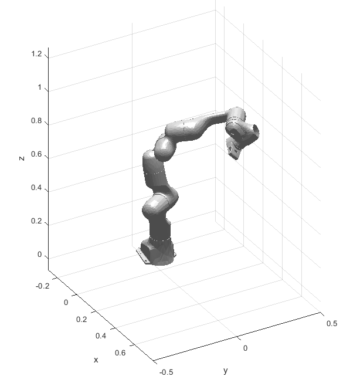

Matlab Rigid Body Dynamics Library
=====
rbdynamics_matlab is a matlab library created for computing dynamics and kinematics of articulated rigid body systems. It is based upon the algorithms within the [Roy Featherstone Rigid Body Dynamics Algorithms book](http://www.springer.com/fr/book/9780387743141).

Several useful functionalities are also included to allow user easy setup joint and task space dynamic parameters. These include the computation of the operational space inertia matrix and the bias acceleration that is required in many task-oriented inverse dynamics control algorithms, i.e. , 

To simplify usage, a urdf parser is included. As such, users can pass in a urdf and have the library generate all the relevant dynamics variables. At this point, open chain systems, be it single chain or branching, are fully supported. To facilitate analyses, visualization methods for stls are provided.

  
Tests
-----
Test scripts are included to compare results using spatial notation with lagrangian dynamics of for a nominal articulated system

Documentation
-----
TODO - pdfs in local folder
